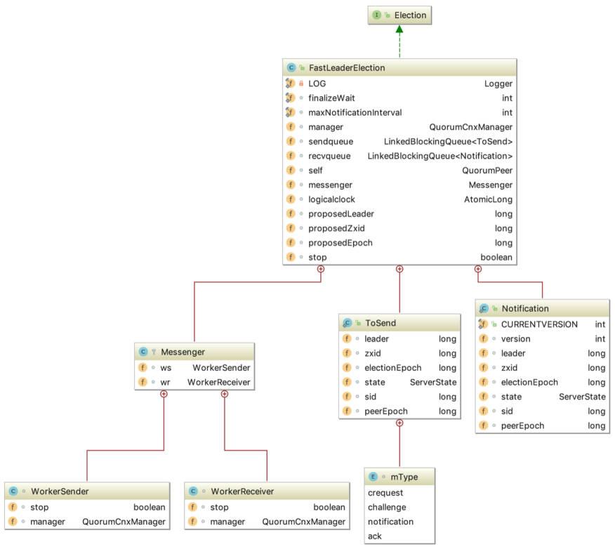

### 单机模式服务端启动

#### 执行过程概述

单机模式的ZK服务端逻辑写在 ZooKeeperServerMain 类中，由里面的 main 函数启动，整个过程如下  


单机模式的委托启动类为： ZooKeeperServerMain  


#### 服务端启动过程

看下 ZooKeeperServerMain 里面的main 函数代码， org.apache.zookeeper.server.ZooKeeperServerMain#initializeAndRun

```java
protected void initializeAndRun(String[] args)
        throws ConfigException, IOException, AdminServerException
    {
        try {
            ManagedUtil.registerLog4jMBeans();
        } catch (JMException e) {
            LOG.warn("Unable to register log4j JMX control", e);
        }

        // 如果入参只有一个，则认为是配置文件的路径。
        ServerConfig config = new ServerConfig();
        if (args.length == 1) {
            config.parse(args[0]);
        } else {
            // 否则是各个参数。
            config.parse(args);
        }

        runFromConfig(config);
    }
```

——> org.apache.zookeeper.server.ZooKeeperServerMain#runFromConfig

```java
public void runFromConfig(ServerConfig config)
            throws IOException, AdminServerException {
        LOG.info("Starting server");
        FileTxnSnapLog txnLog = null;
        try {
            // Note that this thread isn't going to be doing anything else,
            // so rather than spawning another thread, we will just call
            // run() in this thread.
            // create a file logger url from the command line args
            // 初始化日志文件。
            txnLog = new FileTxnSnapLog(config.dataLogDir, config.dataDir);
            // 初始化 ZkServer 对象。
            final ZooKeeperServer zkServer = new ZooKeeperServer(txnLog,
                    config.tickTime, config.minSessionTimeout, config.maxSessionTimeout, null);

            // Registers shutdown handler which will be used to know the
            // server error or shutdown state changes.
            final CountDownLatch shutdownLatch = new CountDownLatch(1);
            zkServer.registerServerShutdownHandler(
                    new ZooKeeperServerShutdownHandler(shutdownLatch));

            // Start Admin server
            adminServer = AdminServerFactory.createAdminServer();
            adminServer.setZooKeeperServer(zkServer);
            adminServer.start();

            boolean needStartZKServer = true;
            if (config.getClientPortAddress() != null) {
                // 初始化 server 端IO对象，默认是 NIOServerCnxnFactory。
                cnxnFactory = ServerCnxnFactory.createFactory();
                // 初始化配置信息。
                cnxnFactory.configure(config.getClientPortAddress(), config.getMaxClientCnxns(), false);
                // 启动服务
                cnxnFactory.startup(zkServer);
                // zkServer has been started. So we don't need to start it again in secureCnxnFactory.
                needStartZKServer = false;
            }
            if (config.getSecureClientPortAddress() != null) {
                secureCnxnFactory = ServerCnxnFactory.createFactory();
                secureCnxnFactory.configure(config.getSecureClientPortAddress(), config.getMaxClientCnxns(), true);
                secureCnxnFactory.startup(zkServer, needStartZKServer);
            }

            /*
            container ZNodes是3.6版本之后新增的节点类型， Container类型的节点会在它没有⼦节点时
            被删除（新创建的Container节点除外），该类就是⽤来周期性的进⾏检查清理⼯作。
             */
            containerManager = new ContainerManager(zkServer.getZKDatabase(), zkServer.firstProcessor,
                    Integer.getInteger("znode.container.checkIntervalMs", (int) TimeUnit.MINUTES.toMillis(1)),
                    Integer.getInteger("znode.container.maxPerMinute", 10000)
            );
            containerManager.start();

            // Watch status of ZooKeeper server. It will do a graceful shutdown
            // if the server is not running or hits an internal error.
            shutdownLatch.await();

            shutdown();

            if (cnxnFactory != null) {
                cnxnFactory.join();
            }
            if (secureCnxnFactory != null) {
                secureCnxnFactory.join();
            }
            if (zkServer.canShutdown()) {
                zkServer.shutdown(true);
            }
        } catch (InterruptedException e) {
            // warn, but generally this is ok
            LOG.warn("Server interrupted", e);
        } finally {
            if (txnLog != null) {
                txnLog.close();
            }
        }
    }
```

zk 单机模式启动主要流程：

1. 注册jmx。
2. 解析 ServerConfig 配置对象。
3. 根据配置对象，运行单机zk服务。
4. 创建管理事务日志和快照 FileTxnSnapLog 对象， zookeeperServer 对象，并设置 zkServer 的统计对象。
5. 设置zk服务钩子，原理是通过设置 CountDownLatch，调用 ZooKeeperServerShutdownHandler 的 handle 方法，可以将触发 shutdownLatch.await 方法继续执行，即调用 shutdown 关闭单机服务。
6. 基于 jetty 创建 zk 的 admin 服务。
7. 创建连接对象 cnxnFactory 和 secureCnxnFactory（安全连接才创建该对象），用于处理客户端的请求。
8. 创建定时清除容器节点管理器，⽤于处理容器节点下不存在⼦节点的清理容器节点⼯作等。

可以看到关键点在于解析配置跟启动两个⽅法，先来看下解析配置逻辑，对应上⾯的configure⽅法，org.apache.zookeeper.server.NIOServerCnxnFactory#configure

```java
public void configure(InetSocketAddress addr, int maxcc, boolean secure) throws IOException {
        if (secure) {
            throw new UnsupportedOperationException("SSL isn't supported in NIOServerCnxn");
        }
        configureSaslLogin();

        maxClientCnxns = maxcc;
        // 会话超时时间。
        sessionlessCnxnTimeout = Integer.getInteger(
            ZOOKEEPER_NIO_SESSIONLESS_CNXN_TIMEOUT, 10000);
        // We also use the sessionlessCnxnTimeout as expiring interval for
        // cnxnExpiryQueue. These don't need to be the same, but the expiring
        // interval passed into the ExpiryQueue() constructor below should be
        // less than or equal to the timeout.
        // 过期队列。
        cnxnExpiryQueue =
            new ExpiryQueue<NIOServerCnxn>(sessionlessCnxnTimeout);
        // 过期线程，从cnxnExpiryQueue中读取数据，如果已经过期则关闭。
        expirerThread = new ConnectionExpirerThread();

        // 根据CPU个数计算selector线程的数量。
        int numCores = Runtime.getRuntime().availableProcessors();
        // 32 cores sweet spot seems to be 4 selector threads
        numSelectorThreads = Integer.getInteger(
            ZOOKEEPER_NIO_NUM_SELECTOR_THREADS,
            Math.max((int) Math.sqrt((float) numCores/2), 1));
        if (numSelectorThreads < 1) {
            throw new IOException("numSelectorThreads must be at least 1");
        }

        // 计算worker线程的数量。
        numWorkerThreads = Integer.getInteger(
            ZOOKEEPER_NIO_NUM_WORKER_THREADS, 2 * numCores);
        // worker线程关闭时间。
        workerShutdownTimeoutMS = Long.getLong(
            ZOOKEEPER_NIO_SHUTDOWN_TIMEOUT, 5000);

        LOG.info("Configuring NIO connection handler with "
                 + (sessionlessCnxnTimeout/1000) + "s sessionless connection"
                 + " timeout, " + numSelectorThreads + " selector thread(s), "
                 + (numWorkerThreads > 0 ? numWorkerThreads : "no")
                 + " worker threads, and "
                 + (directBufferBytes == 0 ? "gathered writes." :
                    ("" + (directBufferBytes/1024) + " kB direct buffers.")));
        // 初始化selector线程。
        for(int i=0; i<numSelectorThreads; ++i) {
            selectorThreads.add(new SelectorThread(i));
        }

        this.ss = ServerSocketChannel.open();
        ss.socket().setReuseAddress(true);
        LOG.info("binding to port " + addr);
        ss.socket().bind(addr);
        ss.configureBlocking(false);
        // 初始化accept线程，只有一个，里面会注册监听Accept事件。
        acceptThread = new AcceptThread(ss, addr, selectorThreads);
    }
```

再来看下启动逻辑， org.apache.zookeeper.server.NIOServerCnxnFactory#startup

```java
public void startup(ZooKeeperServer zkServer) throws IOException,
InterruptedException {
startup(zkServer, true);
}

	// 启动分了好几块，一个一个看。
    @Override
    public void startup(ZooKeeperServer zks, boolean startServer)
            throws IOException, InterruptedException {
        start();
        setZooKeeperServer(zks);
        if (startServer) {
            zks.startdata();
            zks.startup();
        }
    }

	@Override
    public void start() {
        stopped = false;
        // 初始化worker线程池。
        if (workerPool == null) {
            workerPool = new WorkerService(
                "NIOWorker", numWorkerThreads, false);
        }
        // 挨个启动select线程。
        for(SelectorThread thread : selectorThreads) {
            if (thread.getState() == Thread.State.NEW) {
                thread.start();
            }
        }
        // ensure thread is started once and only once
        // 启动 acceptThread 线程。
        if (acceptThread.getState() == Thread.State.NEW) {
            acceptThread.start();
        }
        // 启动 expirerThread 线程。
        if (expirerThread.getState() == Thread.State.NEW) {
            expirerThread.start();
        }
    }

```

——>  org.apache.zookeeper.server.ZooKeeperServer#startdata

```java
// 初始化数据结构。
    public void startdata()
    throws IOException, InterruptedException {
        //check to see if zkDb is not null
        // 初始化ZKDatabase，该数据结构用来保存zk上面存储的所有数据。
        if (zkDb == null) {
            // 初始化数据，这里会加入一些原始节点，例如/zookeeper。
            zkDb = new ZKDatabase(this.txnLogFactory);
        }
        // 加载磁盘上已经存储的数据，如果有的话。
        if (!zkDb.isInitialized()) {
            loadData();
        }
    }

    // 启动剩余项目。
    public synchronized void startup() {
        // 初始化session追踪器。
        if (sessionTracker == null) {
            createSessionTracker();
        }
        // 启动session追踪器。
        startSessionTracker();
        // 建立请求处理链路。
        setupRequestProcessors();

        registerJMX();

        setState(State.RUNNING);
        notifyAll();
    }

    // 这⾥可以看出，单机模式下请求的处理链路为：PrepRequestProcessor -> SyncRequestProcessor -> FinalRequestProcessor。
    protected void setupRequestProcessors() {
        RequestProcessor finalProcessor = new FinalRequestProcessor(this);
        RequestProcessor syncProcessor = new SyncRequestProcessor(this,
                finalProcessor);
        ((SyncRequestProcessor)syncProcessor).start();
        firstProcessor = new PrepRequestProcessor(this, syncProcessor);
        ((PrepRequestProcessor)firstProcessor).start();
    }
```


### Leader选举

#### 总体框架图

```java
public interface Election {
    public Vote lookForLeader() throws InterruptedException;
    public void shutdown();
}
```

实现的子类 AuthFastLeaderElection， LeaderElection 其在3.4.0之后的版本中已经不建议使用；FastLeaderElection 使用。  

选举的父接口为 Election，其定义了 lookForLeader 和 shutdown 两个⽅法， lookForLeader 表示寻找 Leader， shutdown 则表示关闭，如关闭服务端之间的连接。  


#### FastLeaderElection 源码分析  

```java
public class FastLeaderElection implements Election {}
```

FastLeaderElection 实现了 Election 接口，重写了接口中定义的 lookForLeader 方法和 shutdown 方法。了解几个概念：

- 外部投票：特指其他服务器发来的投票。
- 内部投票：服务器自身当前的投票。
- 选举轮次： ZooKeeper 服务器 Leader 选举的轮次，即 logical clock（逻辑时钟）。
- PK：指对内部投票和外部投票进行一个对比确定是否需要变更内部投票。选票管理。
- sendqueue：选票发送队列，用于保存待发送的选票。
- recvqueue：选票接收队列，用于保存接收到的外部投票。  

**FasterLeaderElection 基本架构**



**lookForLeader函数**

当 ZooKeeper 服务器检测到当前服务器状态变成 LOOKING 时，就会触发 Leader 选举，即调用 lookForLeader方法来进行 Leader 选举。  


org.apache.zookeeper.server.quorum.FastLeaderElection#lookForLeader

```java
public Vote lookForLeader() throws InterruptedException {
    synchronized(this){
    // ⾸先会将逻辑时钟⾃增，每进⾏⼀轮新的leader选举，都需要更新逻辑时钟
    logicalclock++;
    // 更新选票（初始化选票）
    updateProposal(getInitId(), getInitLastLoggedZxid(),
    getPeerEpoch());
    }
    LOG.info("New election. My id = " + self.getId() +
    ", proposed zxid=0x" + Long.toHexString(proposedZxid));
    // 向其他服务器发送⾃⼰的选票（已更新的选票）
    sendNotifications();
```

之后每台服务器会不断地从 recvqueue 队列中获取外部选票。如果服务器发现⽆法获取到任何外部投票，就立即确认自己是否和集群中其他服务器保持着有效的连接，如果没有连接，则马上建立连接，如果已经建立了连接，则再次发送自己当前的内部投票，其流程如下  

```java
    // 从recvqueue接收队列中取出投票
    Notification n = recvqueue.poll(notTimeout,
                                    TimeUnit.MILLISECONDS);
    /*
    * Sends more notifications if haven't received enough.
    * Otherwise processes new notification.
    */
    if(n == null){ // ⽆法获取选票
    if(manager.haveDelivered()){ // manager已经发送了所有选票消息
    （表示有连接）
    // 向所有其他服务器发送消息
    sendNotifications();
    } else { // 还未发送所有消息（表示⽆连接）
    // 连接其他每个服务器
    manager.connectAll();
    }
    /*
    * Exponential backoff
    */
    int tmpTimeOut = notTimeout*2;
    notTimeout = (tmpTimeOut < maxNotificationInterval?
    tmpTimeOut : maxNotificationInterval);
    LOG.info("Notification time out: " + notTimeout);
    }
```

在发送完初始化选票之后，接着开始处理外部投票。在处理外部投票时，会根据选举轮次来进行不同的处理。　　

- **外部投票的选举轮次大于内部投票。** 若服务器自身的选举轮次落后于该外部投票对应服务器的选举轮次，那么就会立即更新自己的选举轮次(logicalclock)，并且清空所有已经收到的投票，然后使用初始化的投票来进行PK以确定是否变更内部投票。最终再将内部投票发送出去。
- **外部投票的选举轮次小于内部投票。** 若服务器接收的外选票的选举轮次落后于自身的选举轮次，那么Zookeeper就会直接忽略该外部投票，不做任何处理。
- **外部投票的选举轮次等于内部投票。** 此时可以开始进行选票PK，如果消息中的选票更优，则需要更新本服务器内部选票，再发送给其他服务器。　　

之后再对选票进行归档操作，无论是否变更了投票，都会将刚刚收到的那份外部投票放入选票集合 recvset 中进行归档，其中 recvset 用于记录当前服务器在本轮次的 Leader 选举中收到的所有外部投票，然后开始统计投票，统计投票是为了统计集群中是否已经有过半的服务器认可了当前的内部投票，如果确定已经有过半服务器认可了该投票，然后再进⾏最后⼀次确认，判断是否⼜有更优的选票产生，若无，则终止投票，然后最终的选票，其流程如下

```java
// If notification > current, replace and send messages out
                        // 其选举周期大于逻辑时钟。
                        if (n.electionEpoch > logicalclock.get()) {
                            // 重新赋值逻辑时钟。
                            logicalclock.set(n.electionEpoch);
                            // 清空所有接收到的所有选票。
                            recvset.clear();
                            // 进行pk，选出较优的服务器。
                            if(totalOrderPredicate(n.leader, n.zxid, n.peerEpoch,
                                    getInitId(), getInitLastLoggedZxid(), getPeerEpoch())) {
                                // 更新选票。
                                updateProposal(n.leader, n.zxid, n.peerEpoch);
                            } else {
                                // 无法选出较优的服务器。更新选票。
                                updateProposal(getInitId(),
                                        getInitLastLoggedZxid(),
                                        getPeerEpoch());
                            }
                            // 发送本服务器的内部选票消息。
                            sendNotifications();
                        } else if (n.electionEpoch < logicalclock.get()) { // 选举周期小于逻辑时钟，不作处理，直接忽略。
                            if(LOG.isDebugEnabled()){
                                LOG.debug("Notification election epoch is smaller than logicalclock. n.electionEpoch = 0x"
                                        + Long.toHexString(n.electionEpoch)
                                        + ", logicalclock=0x" + Long.toHexString(logicalclock.get()));
                            }
                            break;
                        } else if (totalOrderPredicate(n.leader, n.zxid, n.peerEpoch,
                                proposedLeader, proposedZxid, proposedEpoch)) { // pk选出较优服务器。
                            // 更新选票。
                            updateProposal(n.leader, n.zxid, n.peerEpoch);
                            // 发送消息。
                            sendNotifications();
                        }

                        if(LOG.isDebugEnabled()){
                            LOG.debug("Adding vote: from=" + n.sid +
                                    ", proposed leader=" + n.leader +
                                    ", proposed zxid=0x" + Long.toHexString(n.zxid) +
                                    ", proposed election epoch=0x" + Long.toHexString(n.electionEpoch));
                        }

                        // recvset用于记录当前服务器在本轮次的leader选举中收到的所有外部投票。
                        recvset.put(n.sid, new Vote(n.leader, n.zxid, n.electionEpoch, n.peerEpoch));

                        // 若能选出leader。
                        if (termPredicate(recvset,
                                new Vote(proposedLeader, proposedZxid,
                                        logicalclock.get(), proposedEpoch))) {

                            // Verify if there is any change in the proposed leader
                            // 遍历已经收到的投票集合。
                            while((n = recvqueue.poll(finalizeWait,
                                    TimeUnit.MILLISECONDS)) != null){
                                // 选票有变更，比之前提议的leader有更好的选票加入，将更优的选票放在recvset中。
                                if(totalOrderPredicate(n.leader, n.zxid, n.peerEpoch,
                                        proposedLeader, proposedZxid, proposedEpoch)){
                                    recvqueue.put(n);
                                    break;
                                }
                            }

                            /*
                             * This predicate is true once we don't read any new
                             * relevant message from the reception queue
                             */
                            // 表示之前提议的leader已经是最优的。
                            if (n == null) {
                                // 设置服务器状态。
                                self.setPeerState((proposedLeader == self.getId()) ?
                                        ServerState.LEADING: learningState());

                                // 最终的选票。
                                Vote endVote = new Vote(proposedLeader,
                                        proposedZxid, proposedEpoch);
                                // 清空 recvqueue 队列的选票。
                                leaveInstance(endVote);
                                // 返回选票。
                                return endVote;
                            }
                        }
                        break;
```

1、自增选举轮次。 在 FastLeaderElection 实现中，有⼀个 logicalclock 属性，用于标识当前 Leader 的选举轮次， ZooKeeper 规定了所有有效的投票都必须在同⼀轮次中。 ZooKeeper 在开始新⼀轮的投票时，会首先对logicalclock 进行自增操作。

2、初始化选票。 在开始进行新⼀轮的投票之前，每个服务器都会首先初始化自己的选票。Vote 数据结构，初始化选票也就是对 Vote 属性的初始化。在初始化阶段，每台服务器都会将自己推举为 Leader。

3、发送初始化选票。 在完成选票的初始化后，服务器就会发起第⼀次投票。 ZooKeeper 会将刚刚初始化好的选票放入 sendqueue 队列中，由发送器 WorkerSender 负责。

4、接收外部投票。 每台服务器都会不断地从 recvqueue 队列中获取外部投票。如果服务器发现无法获取到任何的外部投票，那么就会立即确认自己是否和集群中其他服务器保持着有效连接。如果发现没有建立连接，那么就会马上建立连接。如果已经建立了连接，那么就再次发送自己当前的内部投票。

5、判断选举轮次。 当发送完初始化选票之后，接下来就要开始处理外部投票了。在处理外部投票的时候，会根据选举轮次来进⾏不同的处理。

- 外部投票的选举轮次大于内部投票。如果服务器发现⾃⼰的选举轮次已经落后于该外部投票对应服务器的选举轮次，那么就会⽴即更新⾃⼰的选举轮次（logicalclock），并且清空所有已经收到的投票，然后使用初始化的投票来进行PK以确定是否变更内部投票，最终再将内部投票发送出去。 
- 外部投票的选举轮次小于内部投票。 如果接收到的选票的选举轮次落后于服务器⾃身的，那么 ZooKeeper 就会直接忽略该外部投票，不做任何处理，并返回步骤4。
- 外部投票的选举轮次和内部投票⼀致。 这也是绝大多数投票的场景，如外部投票的选举轮次和内部投票⼀致的话，那么就开始进⾏选票PK。 总的来说，只有在同⼀个选举轮次的投票才是有效的投票。

6、选票PK。 在步骤5中提到，在收到来⾃其他服务器有效的外部投票后，就要进行选票PK了——也就是
FastLeaderElection.totalOrderPredicate 方法的核心逻辑。选票PK的目的是为了确定当前服务器是否需要变更投票，主要从选举轮次、 ZXID 和 SID 三个因素来考虑，具体条件如下：在选票 PK 的时候依次判断，符合任意⼀个条件就需要进行投票变更。 

- 如果外部投票中被推举的Leader服务器的选举轮次大于内部投票，那么就需要进⾏投票变更。
- 如果选举轮次⼀致的话，那么就对比两者的 ZXID。如果外部投票的 ZXID 大于内部投票，那么就需要进行投票变更。 
- 如果两者的 ZXID ⼀致，那么就对比两者的 SID。如果外部投票的 SID 大于内部投票，那么就需要进行投票变更。

7、变更投票。 通过选票PK后，如果确定了外部投票优于内部投票（所谓的“优于”，是指外部投票所推举的服务器更适合成为Leader），那么就进行投票变更——使用外部投票的选票信息来覆盖内部投票。变更完成后，再次将这个变更后的内部投票发送出去。

8、选票归档。 无论是否进行了投票变更，都会将刚刚收到的那份外部投票放入“选票集合” recvset 中进行归档。 recvset ⽤于记录当前服务器在本轮次的 Leader 选举中收到的所有外部投票——按照服务器对应的 SID 来区分，例如， {（1， vote1），（2， vote2）， …}。 

9、统计投票。 完成了选票归档之后，就可以开始统计投票了。统计投票的过程就是为了统计集群中是否已经有过半的服务器认可了当前的内部投票。如果确定已经有过半的服务器认可了该内部投票，则终止投票。否则返回步骤4。 

10、更新服务器状态。 统计投票后，如果已经确定可以终止投票，那么就开始更新服务器状态。服务器会首先判断当前被过半服务器认可的投票所对应的 Leader 服务器是否是自己，如果是自己的话，那么就会将自己的服务器
状态更新为 LEADING。如果自己不是被选举产⽣的 Leader 的话，那么就会根据具体情况来确定自己是 FOLLOWING 或是 OBSERVING。 

以上 10 个步骤，就是 FastLeaderElection 选举算法的核心步骤，其中步骤 4～9 会经过几轮循环，直到 Leader 选举产生。另外还有⼀个细节需要注意，就是在完成步骤9之后，如果统计投票发现已经有过半的服务器认可了当前的选票，这个时候， ZooKeeper 并不会立即进入步骤 10 来更新服务器状态，而是会等待⼀段时间（默认是 200 毫秒）来确定是否有新的更优的投票。


### 集群模式服务端  

执行流程流程


**源码分析**

集群模式下启动所有的ZK节点启动⼊⼝都是 QuorumPeerMain 类的 main ⽅法。 main ⽅法加载配置文件以后，最终会调用到 QuorumPeer的start ⽅法。 

org.apache.zookeeper.server.quorum.QuorumPeer#start

```java
@Override
    public synchronized void start() {
        // 校验ServerId是否合法。
        if (!getView().containsKey(myid)) {
            throw new RuntimeException("My id " + myid + " not in the peer list");
         }
        // 载入之前持久化一些信息。
        loadDataBase();
        // 启动线程监听。
        startServerCnxnFactory();
        try {
            adminServer.start();
        } catch (AdminServerException e) {
            LOG.warn("Problem starting AdminServer", e);
            System.out.println(e);
        }
        // 初始化选举投票以及算法。
        startLeaderElection();
        // 当前也是一个线程。注意run方法。
        super.start();
    }
```

当⼀个节点启动时需要先发起选举寻找 Leader 节点，然后再根据 Leader 节点的事务信息进行同步，最后开始对外提供服务，先来看下初始化选举的逻辑，即上面的 startLeaderElection 方法：  

```java
synchronized public void startLeaderElection() {
       try {
           // 所有节点启动的初始状态都是Looking，这里会创建一张投自己的选票。
           if (getPeerState() == ServerState.LOOKING) {
               currentVote = new Vote(myid, getLastLoggedZxid(), getCurrentEpoch());
           }
       } catch(IOException e) {
           RuntimeException re = new RuntimeException(e.getMessage());
           re.setStackTrace(e.getStackTrace());
           throw re;
       }

       // if (!getView().containsKey(myid)) {
      //      throw new RuntimeException("My id " + myid + " not in the peer list");
        //}
        if (electionType == 0) {
            try {
                udpSocket = new DatagramSocket(myQuorumAddr.getPort());
                responder = new ResponderThread();
                responder.start();
            } catch (SocketException e) {
                throw new RuntimeException(e);
            }
        }
        // 初始化选举算法，electionType 默认为3。
        this.electionAlg = createElectionAlgorithm(electionType);
    }

	@SuppressWarnings("deprecation")
    protected Election createElectionAlgorithm(int electionAlgorithm){
        Election le=null;

        //TODO: use a factory rather than a switch
        switch (electionAlgorithm) {
        case 0:
            le = new LeaderElection(this);
            break;
        case 1:
            le = new AuthFastLeaderElection(this);
            break;
        case 2:
            le = new AuthFastLeaderElection(this, true);
            break;
        case 3:
            // electionAlgorithm 默认是3。
            qcm = createCnxnManager();
            // 监听选举事件的 listener。
            QuorumCnxManager.Listener listener = qcm.listener;
            if(listener != null){
                // 开启监听器。
                listener.start();
                // 初始化选举算法。
                FastLeaderElection fle = new FastLeaderElection(this, qcm);
                // 发起选举。
                fle.start();
                le = fle;
            } else {
                LOG.error("Null listener when initializing cnx manager");
            }
            break;
        default:
            assert false;
        }
        return le;
    }

```

回到 QuorumPeer 类中 start 方法的最后⼀行 super.start()， QuorumPeer 本身也是⼀个线程类，⼀起来看下它的run方法，org.apache.zookeeper.server.quorum.QuorumPeer#run 

```java
@Override
    public void run() {
        updateThreadName();

        LOG.debug("Starting quorum peer");
        try {
            jmxQuorumBean = new QuorumBean(this);
            MBeanRegistry.getInstance().register(jmxQuorumBean, null);
            for(QuorumServer s: getView().values()){
                ZKMBeanInfo p;
                if (getId() == s.id) {
                    p = jmxLocalPeerBean = new LocalPeerBean(this);
                    try {
                        MBeanRegistry.getInstance().register(p, jmxQuorumBean);
                    } catch (Exception e) {
                        LOG.warn("Failed to register with JMX", e);
                        jmxLocalPeerBean = null;
                    }
                } else {
                    RemotePeerBean rBean = new RemotePeerBean(s);
                    try {
                        MBeanRegistry.getInstance().register(rBean, jmxQuorumBean);
                        jmxRemotePeerBean.put(s.id, rBean);
                    } catch (Exception e) {
                        LOG.warn("Failed to register with JMX", e);
                    }
                }
            }
        } catch (Exception e) {
            LOG.warn("Failed to register with JMX", e);
            jmxQuorumBean = null;
        }

        try {
            /*
             * Main loop
             */
            while (running) {
                // 根据当前节点的状态执行不同的流程。
                switch (getPeerState()) {
                case LOOKING:
                    LOG.info("LOOKING");

                    if (Boolean.getBoolean("readonlymode.enabled")) {
                        LOG.info("Attempting to start ReadOnlyZooKeeperServer");

                        // Create read-only server but don't start it immediately
                        final ReadOnlyZooKeeperServer roZk =
                            new ReadOnlyZooKeeperServer(logFactory, this, this.zkDb);
    
                        // Instead of starting roZk immediately, wait some grace
                        // period before we decide we're partitioned.
                        //
                        // Thread is used here because otherwise it would require
                        // changes in each of election strategy classes which is
                        // unnecessary code coupling.
                        Thread roZkMgr = new Thread() {
                            public void run() {
                                try {
                                    // lower-bound grace period to 2 secs
                                    sleep(Math.max(2000, tickTime));
                                    if (ServerState.LOOKING.equals(getPeerState())) {
                                        roZk.startup();
                                    }
                                } catch (InterruptedException e) {
                                    LOG.info("Interrupted while attempting to start ReadOnlyZooKeeperServer, not started");
                                } catch (Exception e) {
                                    LOG.error("FAILED to start ReadOnlyZooKeeperServer", e);
                                }
                            }
                        };
                        try {
                            roZkMgr.start();
                            reconfigFlagClear();
                            if (shuttingDownLE) {
                                shuttingDownLE = false;
                                startLeaderElection();
                            }
                            // 寻找leader节点。
                            setCurrentVote(makeLEStrategy().lookForLeader());
                        } catch (Exception e) {
                            LOG.warn("Unexpected exception", e);
                            setPeerState(ServerState.LOOKING);
                        } finally {
                            // If the thread is in the the grace period, interrupt
                            // to come out of waiting.
                            roZkMgr.interrupt();
                            roZk.shutdown();
                        }
                    } else {
                        try {
                           reconfigFlagClear();
                            if (shuttingDownLE) {
                               shuttingDownLE = false;
                               startLeaderElection();
                               }
                            setCurrentVote(makeLEStrategy().lookForLeader());
                        } catch (Exception e) {
                            LOG.warn("Unexpected exception", e);
                            setPeerState(ServerState.LOOKING);
                        }                        
                    }
                    break;
                case OBSERVING:
                    try {
                        LOG.info("OBSERVING");
                        // 当前节点启动模式为Observer。
                        setObserver(makeObserver(logFactory));
                        // 与leader节点进行数据同步。
                        observer.observeLeader();
                    } catch (Exception e) {
                        LOG.warn("Unexpected exception",e );
                    } finally {
                        observer.shutdown();
                        setObserver(null);  
                       updateServerState();
                    }
                    break;
                case FOLLOWING:
                    try {
                       LOG.info("FOLLOWING");
                       // 当前节点启动模式是Follower。
                        setFollower(makeFollower(logFactory));
                        // 与leader节点进行数据同步。
                        follower.followLeader();
                    } catch (Exception e) {
                       LOG.warn("Unexpected exception",e);
                    } finally {
                       follower.shutdown();
                       setFollower(null);
                       updateServerState();
                    }
                    break;
                case LEADING:
                    LOG.info("LEADING");
                    try {
                        // 当前节点启动模式为Leader。
                        setLeader(makeLeader(logFactory));
                        // 发送自己成为leader的通知。
                        leader.lead();
                        setLeader(null);
                    } catch (Exception e) {
                        LOG.warn("Unexpected exception",e);
                    } finally {
                        if (leader != null) {
                            leader.shutdown("Forcing shutdown");
                            setLeader(null);
                        }
                        updateServerState();
                    }
                    break;
                }
                start_fle = Time.currentElapsedTime();
            }
        } finally {
            LOG.warn("QuorumPeer main thread exited");
            MBeanRegistry instance = MBeanRegistry.getInstance();
            instance.unregister(jmxQuorumBean);
            instance.unregister(jmxLocalPeerBean);

            for (RemotePeerBean remotePeerBean : jmxRemotePeerBean.values()) {
                instance.unregister(remotePeerBean);
            }

            jmxQuorumBean = null;
            jmxLocalPeerBean = null;
            jmxRemotePeerBean = null;
        }
    }
```

节点初始化的状态为 LOOKING，因此启动时直接会调用 lookForLeader 方法发起 Leader 选举，org.apache.zookeeper.server.quorum.FastLeaderElection#lookForLeader

```java

```

经过上⾯的发起投票，统计投票信息最终每个节点都会确认⾃⼰的身份，节点根据类型的不同会执⾏以
下逻辑：

1. 如果是 Leader 节点，首先会想其他节点发送⼀条 NEWLEADER 信息，确认自己的身份，等到各个节点的ACK消息以后开始正式对外提供服务，同时开启新的监听器，处理新节点加⼊的逻辑。
2. 如果是 Follower 节点，首先向 Leader 节点发送⼀条 FOLLOWERINFO 信息，告诉 Leader 节点自己已处理的事务的最大 Zxid，然后 Leader 节点会根据自己的最大 Zxid 与 Follower 节点进⾏同步，如果 Follower 节点落后的不多则会收到 Leader 的 DIFF 信息通过内存同步，如果 Follower 节点落后的很多则会收到 SNAP 通过快照同步，如果 Follower 节点的 Zxid 大于 Leader 节点则会收到 TRUNC 信息忽略多余的事务。
3. 如果是Observer节点，则与Follower节点相同。


